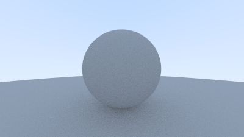
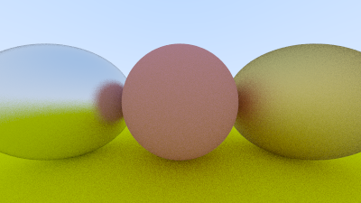
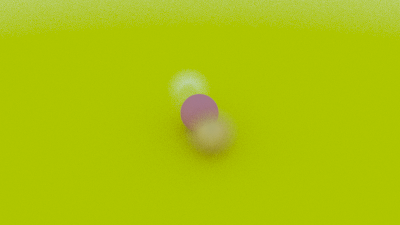
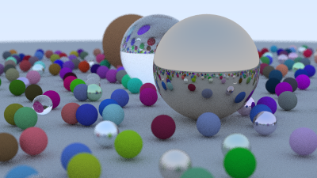

# raytracing
A simple C++ raytracing project.

This project is based on the Ray Tracing in One Weekend series of books: [_Ray Tracing in One Weekend_](https://raytracing.github.io)

## Step (1)

## Step (2)

## Step (3)

## Step (4)

## Step (5)

## Step (6)

## Step (7)

## Step (8)

## Step (9)

## Step (final)
